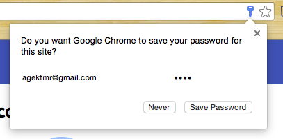
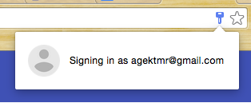
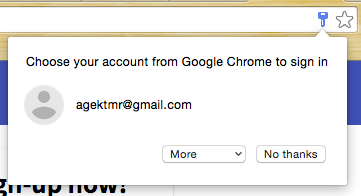
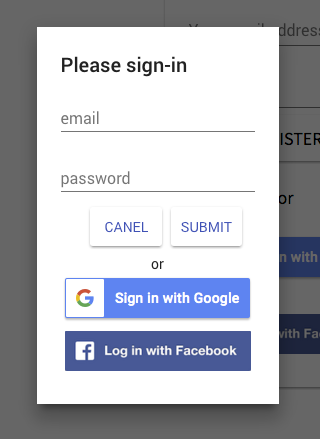
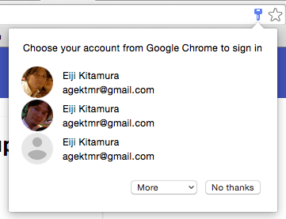
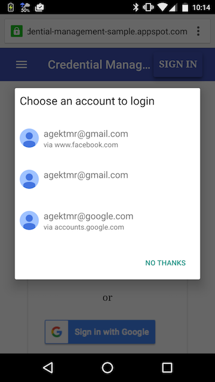

# Credential Management API Sample

- Try [a live demo](https://credential-management-sample.appspot.com).
- Learn [how Credential Management API works]().

## Installation

### Prerequisites
- Google App Engine
- Python 2.7
- pip
- Node.js
- NPM
- Bower

### Step 1. Configure Google Sign-In
- Set up a new project at [Google Developers Console](https://console.developers.google.com/)
- Create credentials
- Download `client_secret_****.json`, rename it to `client_secrets.json`
- Place `client_secrets.json` at root of this project


### Step 2. Configure Facebook Login
- Set up a new project at [Facebook Developers](https://developers.facebook.com/)
- Set "Site URL" `http://localhost:8080`
- Copy and paste the App ID at line 18 of `static/scripts/app.js`.


### Step 3. Install dependencies
- After cloning this repository, do the following:

```sh
# Clone submodules
$ git submodule init
$ git submodule update
# This command will install dependencies
$ npm install
```

### Step 4. Run the app
```sh
# Launch App Engine at root dir of this project with following command
$ dev_appserver.py .
```

## What is this demo about?
This is a demo of an open standard for the web - [Credential Management
API](https://w3c.github.io/webappsec-credential-management/). The Credential
Management API allows you to store and retrieve user's credential information
from and to browsers programatically using JavaScript. For example, Google
Chrome allows you to access those credentials stored in its password manager
(chrome://settings/passwords). If a user is signed into Chrome,  he/she can sync
its credential data across devices so they are accessible from home pc, work pc
or even on mobile.

## How can I try it?
### Step 0. Meet prerequisites
To experiment with this demo you have meet the following conditions:

* Use Google Chrome 49 or later (try dev channel as of Dec 15, 2015). Previous
versions have Credential Management API implemented but with incompatible APIs.
* Turn on a flag at chrome://flags/#enable-credential-manager-api and restart
* You are signed into Google Chrome
* Chrome Sync is enabled
* Make sure that "auto sign-in" is enabled at chrome://settings/passwords

### Step 1. Sign up and store id and password to password manager
Make sure that your password manager is empty for the origin
[https://credential-management-sample.appspot.com/](https://credential-management-sample.appspot.com/).
Check it at chrome://settings/passwords and search for the origin.
On
[https://credential-management-sample.appspot.com/](https://credential-management-sample.appspot.com/),
enter name, email address and password (don't put a real password!) and sign up.
You will then be signed-in and your browser will ask you to store credential
information in the password manager.


Choose "Save Password" to save the credential.

### Step 2. Experience automatic sign-in
This demo site doesn't use server side sessions, which means your signed-in
state won't be persisted across multiple requests. Thus, if you reload the
page without the credential manager enabled, you will see the login form
again.

Now you have the credential manager enabled and you will be able to sign-in
automatically. Let's reload the page. You will see a popup saying
"Signing in as …" and got signed in. This is the magic of the auto sign-in
feature that the Credential Management API provides.


### Step 3. Sign out to enable the "mediation mode"
Signing out from the site by clicking "Sign Out" brings you back to signed
out state. This will also turn on the "mediation mode". The mediation mode
prevents you from being automatically sign-in. It's usually turned on when a user
explicitly indicates he/she wants to be signed out. This is typically the case
when a user explicitly clicks on "sign out" button.

### Step 4. Explicit sign-in and disable the "mediation mode"
By clicking on "Sign In", a popup shows up and asks you to choose an account.



By clicking on the account you have just created, you can sign in without typing
a password. This is called "semi auto sign-in" which will also disable the
"mediation mode". This means next time you will visit the site, you will be
automatically signed in (when you are signed out).
By choosing "No thanks", you can skip "semi-auto sign-in" and see a sign-in
form which also happens on browsers where Credential Management API is not
available.



### Step 5. Add more accounts using Federation
When you are seeing sign-in form, choose Google Sign-In (or Facebook Login) to
sign in using a federated identity. This will store federation credential to the
password manager and you will have the Google account as second or third option
of sign-in accounts.

Notice that by reloading the page, you won't auto signed in any longer. This is
because you have multiple accounts and you will have to manually select one of
those accounts. Try clicking on "Sign In" button. You should now see list of all
stored accounts.



### Step 6. Try on different devices
Now switch your device. It could be another PC, Chromebook or Android device -
anywhere Google Chrome can run. Make sure to meet the same conditions as Step 0.
Access
[https://credential-management-sample.appspot.com/](https://credential-management-sample.appspot.com/).

See if credentials you've stored on previous browser are successfully synced
across and you have multiple accounts to choose from when clicking on "Sign In".


