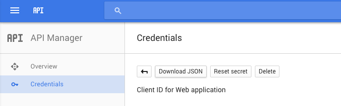
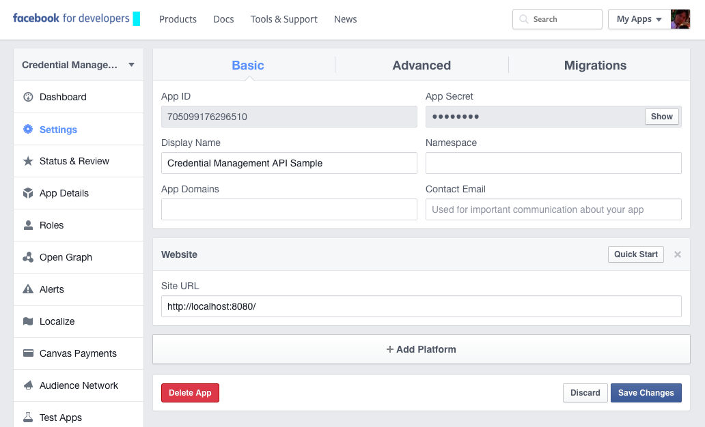

# Credential Management API Sample

- Try [a live demo](https://credential-management-sample.appspot.com).
- Learn [how Credential Management API works](https://developers.google.com/web/updates/2016/04/credential-management-api).
- Learn [how to implement](https://g.co/CredentialManagementAPI).
- Learn [what's updated in Chrome 60](https://developers.google.com/web/updates/2017/06/credential-management-updates).
- Try [codelab](https://g.co/codelabs/cmapi).

## Installation

### Prerequisites
- Google App Engine
- Python 2.7
- pip
- Node.js
- NPM
- Bower

### Step 1. Configure Google Sign-In
- Set up a new project at [Google Developers Console](https://console.developers.google.com/)
- Create credentials
- Download `client_secret_****.json`, rename it to `client_secrets.json`
- Place `client_secrets.json` at root of this project



### Step 2. Configure Facebook Login
- Set up a new project at [Facebook Developers](https://developers.facebook.com/)
- Set "Site URL" `http://localhost:8080`
- Copy and paste the App ID in `app.yaml`.



### Step 3. Install dependencies
```sh
# Create virtual env
$ virtualenv env
$ source env/bin/activate
# Clone submodules
$ git submodule init
$ git submodule update
# This command will install dependencies
$ npm install
$ npm run build
```

### Step 4. Run the app
```sh
# Launch App Engine at root dir of this project with following command
$ npm start
```
